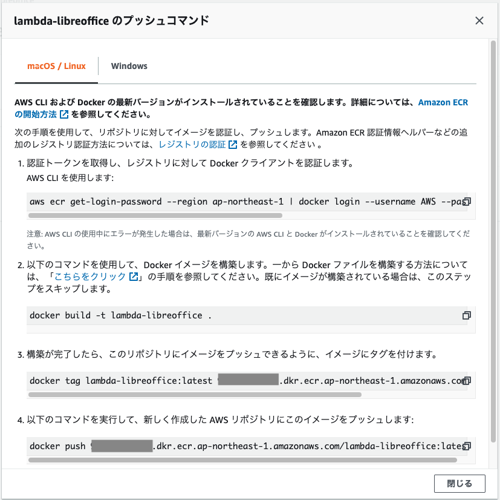
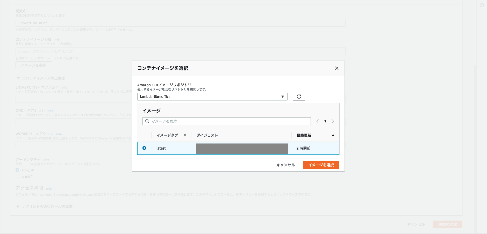
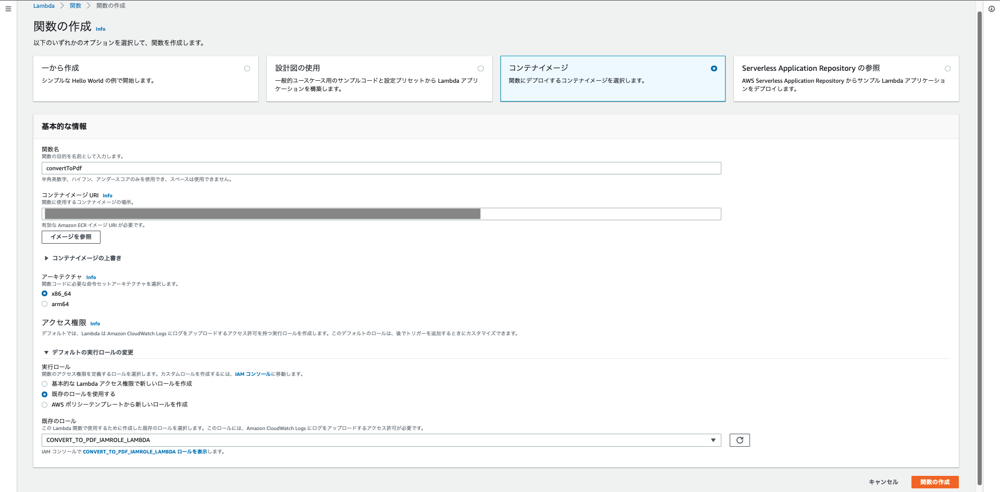
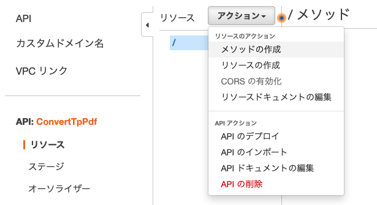
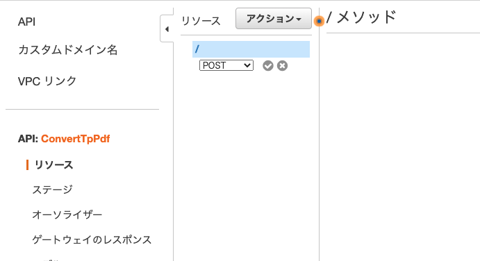
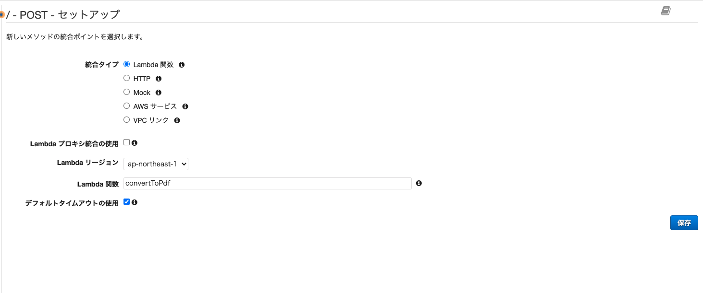
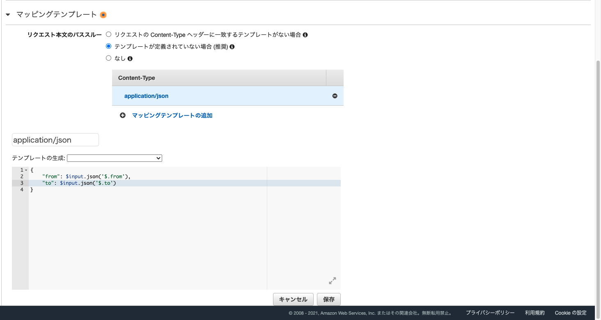
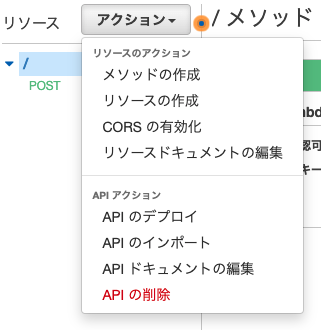
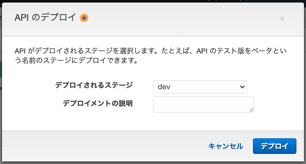
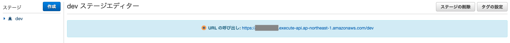

# Lambda用コンテナーイメージ「lambda-libreoffice」  

本リポジトリはLambdaとAPI GatewayでPDF変換機能を提供するためのカスタムコンテナのソースコードです。  

このカスタムコンテナは以下のAPI仕様を想定しています。

* Lambdaのカスタムコンテナを使用  
* Lambda関数はファイルの入出力にS3を使う  
* Amazon API Gatewayを使用    
* APIはjsonデータをPOSTで受け取り、    
  変換後のファイルのパスを返す。
* POSTするjsonデータは以下の書式とする。  
```
{
  "from": "s3://example-from-bucket/lambda-libreoffice.xlsx",
  "to": "s3://example-to-bucket"
}
```
* APIはPDF変換したPDFファイルを出力先にアップロードし、そのパスを返却する。  
```
s3://example-to-bucket/lambda-libreoffice.pdf
```
  
このファイルでは、  
本リポジトリのソースを用いて、  
Lambda関数とAPIを構築する手順を記載しています。  

## コンテナのビルドとECRへのプッシュの仕方

ECRのリポジトリ作成  
```[region]```の部分は環境に合わせて変更 してください。  

```
aws ecr create-repository --repository-name lambda-libreoffice --region [region]
```

このような値が返ってきます。  

```
{
    "repository": {
        "registryId": "[aws_account_id]", 
        "repositoryName": "lambda-libreoffice", 
        "repositoryArn": "arn:aws:ecr:[region]:[aws_account_id]:repository/lambda-libreoffice", 
        "createdAt": 1636780666.0, 
        "repositoryUri": "[aws_account_id].dkr.ecr.[region].amazonaws.com/lambda-libreoffice"
    }
}
```


```[aws_account_id]```の部分は自身のアカウントIDに読み変えてください。
この後は ConsoleでECRの画面を開き、作成されたリポジトリを見ます。  
「プッシュコマンドの表示」というボタンがあるのでそれをクリック。  
以降、表示されているコマンドを実行していくとビルド〜プッシュができます。  



### プッシュ時の注意事項

```
Error: Cannot perform an interactive login from a non TTY device
```

のエラーが出る場合は、  
aws cliのバージョンが古かったり(バージョン2が必要のようです)、  
--regionではなく--profileでプロファイル名を指定したりすると解消するようです。  
  
[AWS - AWS CLI バージョン 2 のインストール、更新、アンインストール](https://docs.aws.amazon.com/ja_jp/cli/latest/userguide/install-cliv2.html)
[Qiita - https://qiita.com/nomi3/items/970b340caab59e8afb2e](https://qiita.com/nomi3/items/970b340caab59e8afb2e)

```
denied: Your authorization token has expired. Reauthenticate and try again.
```
のエラーが出る場合は、「プッシュコマンドの表示」にある  
「1.認証トークンを取得し、レジストリに対して Docker クライアントを認証します。」  
のコマンドを実行するとプッシュができるようになります。  

## Lambda関数の作成

Lambdaで「関数の作成」で、「コンテナイメージ」を選択し、  
「コンテナイメージURI」で「イメージを参照をクリック」、  
プッシュしたコンテナイメージを選択します。

  



実行ロールは次のポリシーを付与したものを適用します。  

* AWSLambdaBasicExecutionRole 
* AmazonS3FullAccess
  
メモリは256MB、  
タイムアウト値はまずは1分程度がよいと思います。

これで実行可能になります。

## Lambda関数のテスト方法

* 引数

S3にある入力ファイルのフルパスと、  
出力先のパスを指定します。
```
{
  "from": "s3://example-from-bucket/lambda-libreoffice.xlsx",
  "to": "s3://example-to-bucket"
}
```

* 戻り値  
  
成功すると生成されたPDFファイルのフルパスが返ります。

```
s3://example-to-bucket/lambda-libreoffice.pdf
```

## REST APIの作成

* Amazon API Gatewayで「API を作成」をクリック。  
* 「REST API」を選択。 
* 「REST」、「新しいAPI」を選択。
*  API名を入力します。

* リソースの「アクション」で「メソッドの作成」をクリック。
  

* ドロップダウンで「POST」を選択。  
  

* Lambda関数を選択。 
  

* 右側の画面に「メソッドリクエスト」・「統合リクエスト」などが表示されます。  
  統合リクエストで、パラメータをjsonに変換するための定義を設定します。  
  

  マッピングテンプレートには以下のように記述します。
  ```
  {
    "from": $input.json('$.from'),
    "to": $input.json('$.to')
  }
  ```

  なお、マッピングテンプレートの書き方は、  
  POSTとGETで微妙に異なるので注意してください。    
  [Qiita - AWS Lambda + API Gateway＜POST＞ の使い方【初心者】](https://qiita.com/koshi_an/items/98b12216a69258358d37)  
  [Qiita - AWS Lambda + API Gateway＜GET＞ の使い方【初心者】](https://qiita.com/koshi_an/items/fd1b97b35e52bab5f7e9)


以上でAPIが使用可能になります。  
APIのテスト機能でテストする場合は、  
テストのリクエスト本文にjson形式でパラメータを指定します。
```
{
  "from": "s3://example-from-bucket/lambda-libreoffice.xlsx",
  "to": "s3://example-to-bucket"
}
```

## REST APIのデプロイ

POSTMANなどの外部サービスからの呼び出す場合は、  
APIのデプロイを実行してください。  

「リソース」の「アクション」で、「APIのデプロイ」を選択します。  

  
ステージを選択または追加してデプロイします。


ステージの画面の上部あるURLでAPIにアクセスすることができるようになります。  



## Dockerfileについて

### Dockerfile作成時の参考資料
[dockerhub - amazon/aws-lambda-provided](https://docs.aws.amazon.com/lambda/)  
※Lambda用のAWS公式Dockerイメージのページです。

### bootstrap、function.sh作成時の参考資料  

[AWS - Tutorial – Publishing a custom runtime](latest/dg/runtimes-walkthrough.html)

公式ドキュメントには特に記載はないが、  
どうやらbootstrapとfunstion.shには実行権限が必要なようなので、  
権限付与を追加してます。  
